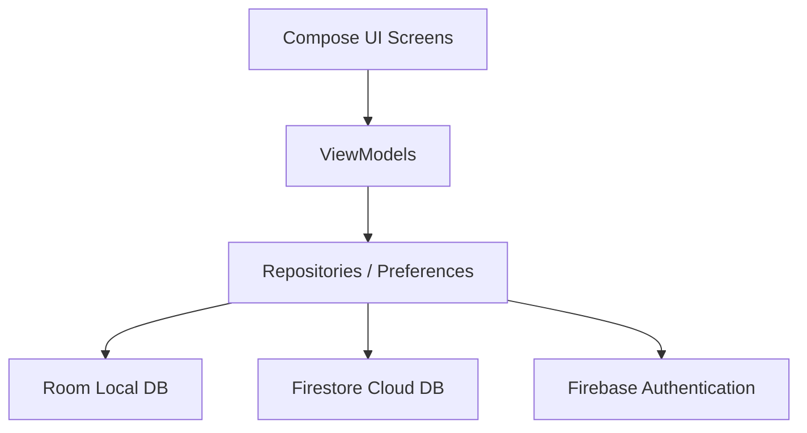

# 🏋️‍♂️ Gym Buddy

[](https://kotlinlang.org)
[](https://developer.android.com)
[](https://developer.android.com/jetpack/compose)
[](https://firebase.google.com)
[](https://developer.android.com/training/data-storage/room)

**Gym Buddy** is a modern, feature-rich Android application designed for fitness enthusiasts who want to track their workouts, build custom routines, analyze training statistics, and share their progress with a community of friends. Built with native **Kotlin**, **Jetpack Compose (Material 3)**, and powered by **Firebase** for cloud social features and **Room** for offline-first local persistence.

---

## ✨ Key Features

### 🏋️‍♂️ Workout & Routine Planner
* **Active Workout Logger**: Record exercises, reps, sets, and weights in real-time. Supports different set types: **Normal (N)**, **Warm-up (W)**, **Drop Set (D)**, and **Failure (F)**.
* **Routine Builder**: Create custom workout plans/routines so you can start pre-planned workouts quickly at the gym.
* **Rest Timer & Duration Tracking**: Track total active training time automatically.

### 🔄 Metric & Imperial Support (KG & LBS)
* Seamless Unit System toggle in settings (Metric / Imperial).
* Automatic real-time UI conversion between **kilograms (kg)** and **pounds (lbs)**.
* Standardized base units (KG) in the Room local database to maintain consistent data integrity.

### 👥 Social Fitness Feed
* **Interactive Feed**: Share your completed workout summaries directly to the community feed.
* **Likes & Comments**: Support your buddies by liking and commenting on their workouts.
* **Friend System**: Search and add gym buddies using their email addresses to create your fitness network.

### 📊 Advanced Statistics & Progress
* **Volume Analysis**: Track total volume lifted and session count over time.
* **Muscle Focus Grouping**: Dynamic calculation of sets performed per target muscle group (e.g., Chest, Back, Legs).
* **Personal Records**: Track your maximum weight lifted for each exercise.

### 🎨 Premium UI & Customization
* **Material 3 Design**: Clean typography, card layouts, and premium design language.
* **System/Light/Dark Mode**: Dynamic color theme support matching your system preference.
* **Smooth Transitions**: Integrated Navigation Compose with preserved stack states for seamless tab switching.

---

## 🛠️ Architecture & Tech Stack

The application follows the **clean architecture** principles and the standard **MVVM (Model-View-ViewModel)** design pattern.



### Technical Stack:
* **UI**: [Jetpack Compose](https://developer.android.com/jetpack/compose) with [Material 3](https://m3.material.io/) components.
* **Asynchronous Flow**: Kotlin Coroutines & StateFlow/SharedFlow.
* **Local Storage**: [Room Database](https://developer.android.com/training/data-storage/room) (SQLite ORM) for offline-first user workouts, sets, and routines.
* **Cloud Database**: [Firebase Firestore](https://firebase.google.com/docs/firestore) for storing profiles, social posts, friendships, and notification feeds.
* **Authentication**: [Firebase Auth](https://firebase.google.com/docs/auth) supporting Email/Password and Google Sign-In credentials.
* **Navigation**: Jetpack Compose Navigation.

---

## 📂 Codebase Directory Structure

```text
app/src/main/java/com/corecoders/gymbuddy/
│
├── data/                      # Data Layer (Database, Entities, Repositories)
│   ├── dao/                   # Room Data Access Objects (WorkoutDao, RoutineDao)
│   ├── dto/                   # Data Transfer Objects for Firestore
│   ├── AppDatabase.kt         # Local Room Database Configuration
│   ├── AuthManager.kt         # Helper for authentication flows
│   ├── Models.kt              # Core data classes (Workout, Set, Exercise)
│   ├── SocialRepository.kt    # Repository managing Firestore network queries
│   └── UserPreferences.kt     # DataStore/SharedPreferences helper for settings
│
├── screens/                   # Presentation Layer (Jetpack Compose Composables)
│   ├── ActiveWorkoutScreen.kt # Logger interface for live training
│   ├── DashboardScreen.kt     # Summary of active streak & statistics
│   ├── LoginScreen.kt         # User login screen (Email & Google sign-in)
│   ├── ProfileScreen.kt       # Displays workouts history, stats, and settings
│   ├── SocialScreen.kt        # Main Community Feed and Friend Finder
│   └── WorkoutSummaryScreen.kt# Completion summary and feed sharing utility
│
├── viewmodel/                 # ViewModel Layer (State management & Business logic)
│   ├── ActiveWorkoutViewModel.kt
│   ├── ProfileViewModel.kt
│   ├── SocialViewModel.kt
│   └── StatsViewModel.kt
│
└── MainActivity.kt            # App Entry Point & Navigation Graph Setup
```

---

## 🚀 Setup & Installation

Follow these steps to run the Gym Buddy project locally in Android Studio:

### Prerequisites:
1. **Android Studio** (Ladybug 2024.2.1 or newer recommended).
2. **JDK 17** or newer configured.
3. Android SDK 34 (Android 14) installed.

### Installation Steps:

1. **Clone the Repository:**
   ```bash
   git clone https://github.com/your-username/gym-buddy.git
   cd gym-buddy
   ```

2. **Configure Firebase:**
   * Go to the [Firebase Console](https://console.firebase.google.com/) and create a new project.
   * Add an Android App to the project using package name `com.corecoders.gymbuddy`.
   * Download the `google-services.json` file.
   * Move the `google-services.json` file into the `/app` directory of this project.

3. **Enable Firebase Services:**
   * **Authentication**: Enable Email/Password and Google Sign-in providers.
   * **Cloud Firestore**: Start in test mode or define rules protecting user posts.

4. **Run the App:**
   * Open the project in Android Studio.
   * Allow Gradle to sync dependencies.
   * Connect an Android device or start an Emulator (API 26+).
   * Click **Run (Shift + F10)**.

---

## 🔒 Security & Data Privacy

* **User Privacy First**: Includes a complete account deletion mechanism. When deleting an account, the app clears the local database tables and calls a Firestore batch transaction to wipe all user data (posts, friend lists references, profile data) and cancels the authentication profile.
* **Fresh Authentication Checks**: Sensitive account deletion requests are protected. If the user session is older than 5 minutes, the app automatically prompts the user to re-authenticate for safety.

---

## 🤝 Contributing

Contributions are welcome! Please feel free to open a Pull Request or report bugs via Issues.

1. Fork the Project.
2. Create your Feature Branch (`git checkout -b feature/AmazingFeature`).
3. Commit your Changes (`git commit -m 'Add some AmazingFeature'`).
4. Push to the Branch (`git push origin feature/AmazingFeature`).
5. Open a Pull Request.

---

## 📄 License
This project is licensed under the MIT License - see the LICENSE file for details.